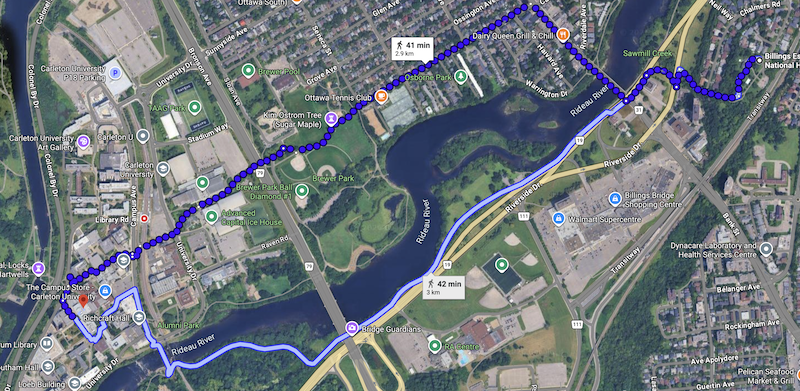

# Schedule

There is a rough parallel between what we do in this course, and the sequence of actions that turns human debris into archaeological knowledge. Roughly, we move from **capturing/creating** data, to **considering/critiquing** both the data and our methods working with and through the information, to **communicating** the data (both to other researchers, and to wider publics). This last one can also include reproduction/replicability of earlier studies, which means that all of this isn't linear, but circular. That circularity carries with it the implication that your _research process_, your notes, your thinking about what you're doing, and all of that messy emphemera, are _also_ archaeological data and need to be documented, and fed into the circle.

Nothing is ever one and done.

## Animating Questions for each Module

**M1: Capturing/Creating Data** How does the human past become data? What does it mean to turn the different kinds of traces we have into something that becomes… counted? And how does the act of counting change what gets valued? In this module, aside from setting up your digital work bench, you’ll get some experience of turning the world into data, and you will think deeply about what that means.

**M2: Considering/Critiquing Data** In this module, we explore various transformations we can do to the digitized materials created in module 1, why we might do them, and ask how the different ways these transformations are ethically, theoretically laden. Your choices matter, so that’s why you document the process. Why _this_ approach, and not another? What are the _consequences_ of that choice?

**M3: Communicating** In this final module, you will try to find the compelling story and to communicate it, in various ways, to your intended public. To whom does archaeology belong? Does it matter how we tell the story?

## Each Week

We have a three hour block of time each week. I will lecture for the full three hours almost never. Instead, we might do a variety of things - me, setting the scene; unconference-style discussions of readings or computational exercises; tutorial-style walk throughs as we fight with the computer together. It is critical however that you come to class prepared. **You need to have read** anything I list for readings for any given day, if you want to get the most out of this class. 'Coming prepared' is an act of respect - you respect where I am coming from, and so will not waste my time by making me do the work for you; I respect your time by assuming you want to be here and are ready to explore.

See the relevant weeks' pages using the navigation at left. That panel does scroll, fyi, if you cannot see all of the various weeks.

## Billings Estate

We will be going over to the Billings Estate a few times throughout the term (but mostly towards the start of term; check the 'Week' pages). Depending on the number of people enrolled in this course, we might split up and some stay on campus, some go to the Estate, then we'll switch the following week. It depends on enrollment numbers and whether or not a TA gets assigned to this class. Stay tuned. On days where we meet at the Billings Estate, we will start at 12.35 to enable you to get there on foot, meeting at its graveyard - it's about a 3 km walk; see this [google map](https://maps.app.goo.gl/ctKjbofkzDd8gtdx7).

