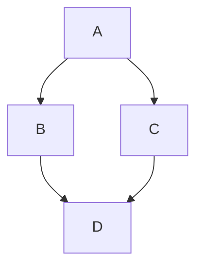

# Week 1

Here we are?

{: .note } 
And this is important

blah blah

Image:


I'm a label
{: .label }

blue
{: .label .label-blue }
green
{: .label .label-green }
purple
{: .label .label-purple }
yellow
{: .label .label-yellow }
red
{: .label .label-red }

**bold**
{: .label }
*italic*
{: .label }
***bold + italic***
{: .label }

### Definition lists can be used with HTML syntax.

<dl>
<dt>Name</dt>
<dd>Godzilla</dd>
<dt>Born</dt>
<dd>1952</dd>
<dt>Birthplace</dt>
<dd>Japan</dd>
<dt>Color</dt>
<dd>Green</dd>
</dl>

#### Multiple description terms and values

Term
: Brief description of Term

Longer Term
: Longer description of Term,
  possibly more than one line

Term
: First description of Term,
  possibly more than one line

: Second description of Term,
  possibly more than one line

Term1
Term2
: Single description of Term1 and Term2,
  possibly more than one line

Term1
Term2
: First description of Term1 and Term2,
  possibly more than one line

: Second description of Term1 and Term2,
  possibly more than one line

### More code

```python
def dump_args(func):
    "This decorator dumps out the arguments passed to a function before calling it"
    argnames = func.func_code.co_varnames[:func.func_code.co_argcount]
    fname = func.func_name
    def echo_func(*args,**kwargs):
        print fname, ":", ', '.join(
            '%s=%r' % entry
            for entry in zip(argnames,args) + kwargs.items())
        return func(*args, **kwargs)
    return echo_func

@dump_args
def f1(a,b,c):
    print a + b + c

f1(1, 2, 3)

def precondition(precondition, use_conditions=DEFAULT_ON):
    return conditions(precondition, None, use_conditions)

def postcondition(postcondition, use_conditions=DEFAULT_ON):
    return conditions(None, postcondition, use_conditions)

class conditions(object):
    __slots__ = ('__precondition', '__postcondition')

    def __init__(self, pre, post, use_conditions=DEFAULT_ON):
        if not use_conditions:
            pre, post = None, None

        self.__precondition  = pre
        self.__postcondition = post
```

```
Long, single-line code blocks should not wrap. They should horizontally scroll if they are too long. This line should be long enough to demonstrate this.
```

### Mermaid Diagrams

The following code is displayed as a diagram only when a `mermaid` key supplied in `_config.yml`.



### Collapsed Section

The following uses the [`<details>`](https://docs.github.com/en/get-started/writing-on-github/working-with-advanced-formatting/organizing-information-with-collapsed-sections) tag to create a collapsed section.

<details markdown="block">
<summary>Shopping list (click me!)</summary>

This is content inside a `<details>` dropdown.

- [ ] Apples
- [ ] Oranges
- [ ] Milk

</details>

{: .warning } 
And this is a warning

blurg lburg
