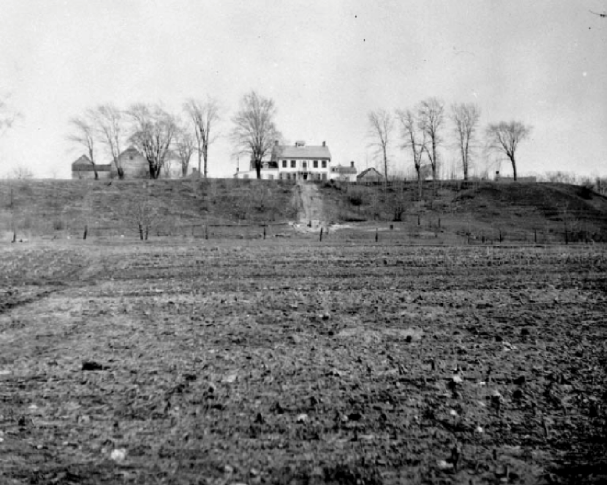

# Week 2 - Sept 21

## Introduction to the Billings Estate

_If we've split the class to make numbers manageable, group A goes to the Billings Estate, while group B will stay in the classroom and do the materials listed as **Week 3**. Then, next week, group A does the week 3 materials and group B does the week 2 materials._

**Location**: Billings Estate (start time: 12.35)

**Theme**: Mortuary Archaeology and Data Collection. As we work at the estate, how do the ethical issues discussed in the readings surface in what we are doing? Are there ethical or physical dangers for you? How does the work I am asking you to do present ethical or moral challenges?

**Have Read for Today**:

+ Billings Family Virtual Exhibit [a pdf actually](https://documents.ottawa.ca/sites/default/files/billings%20family%20virtual%20exhibit_en.pdf)

+ Dennis, L. 2021. Getting It Right and Getting It Wrong in Digital Archaeological Ethics. In: Champion, E (ed.), Virtual Heritage. London: Ubiquity Press. DOI: [https://doi.org/10.5334/bck.j](https://doi.org/10.5334/bck.j)

+ Graham's [cheat sheet on mortuary archaeology](./assets/support/#).

+ Huggett, J. (2026) ‘Ethics and Digital Archaeology’, in E. Barker, O. Bobou, and R. Raja (eds) The Oxford Handbook of Digital Classical Studies. Oxford: Oxford University Press, pp. 136–148 [preprint version available behind this link](https://works.hcommons.org/records/b79ag-11n88).

**The Plan**:
- Meet at the Billings Estate Graveyard
- Last day I asked you to build a personal data set- we're going to start by discussing that. What challenged you, and if you can, why did it challenge you? What kind of meaningful differences would exist in your dataset if you were documenting physical materials?
- Then we'll divy up the work
- As you perform the work, record not just what you're doing, but also your thoughts and impressions on the work. Discuss with each other the readings as you do the work. This is a national historic site; to whom does this data belong? What choices are foisted upon you because of the technology you're working with? How might that impact the questions you could ask of this data?

**Skill Building** We will break into groups and attempt to record all of the gravestone information that is visible. You will need a smartphone or tablet. 
  - Visual data recording using field collection forms: [Detailed instructions are behind this link](./assets/support/#).
  - Photogrammetric data recording: We will try our hand at in-situ photogrammetric recording of the gravestones- [detailed instructions are behind this link](./assets/support/#) and note that you should download and install some of the suggested apps before hand. It is possible to develop photogrammetric models from images/video that you process later, so if you do not wish to use an app that is ok; photos and videos for later processing is viable (we have software in the XLab for doing this). You might also want to try recording the ice house.
  - Simple mapping of the graveyard: [Detailed instructions are behind this link](./assets/support/#).

**Homework** By Friday at noon, have your research compendium for this week complete and in github. Remember, those discussions we have while we do the work? That stuff needs recording and thinking about too! 

_City of Ottawa Archives_ ca 002104
