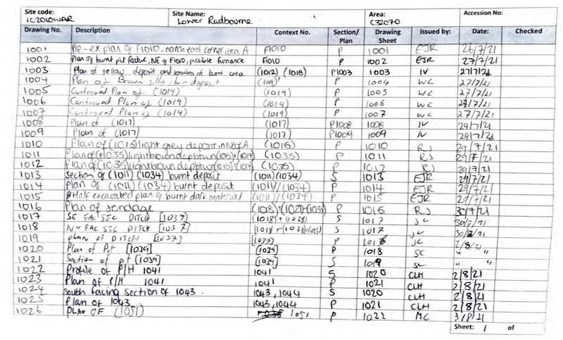

# Week 4 - Oct. 5

**Location** NCC, 75 Albert Street, with Monica Maika, at 12.15 and at 1.15 (we'll divide into two smaller groups to keep things manageable for our hosts).

**Theme** Documenting small finds, digitizing records

**Have Read for Today**
+ D’Ignazio, Catherine and Klein, L. 2020. ‘What gets counted, counts’. From Data Feminism [link](https://data-feminism.mitpress.mit.edu/pub/h1w0nbqp/release/3)

**The Plan**
We're visiting the NCC's archaeology labs downtown to see how they document their materials. With permission, we will make 3d models and we will scan documentation from NCC projects. We are moving from the physical to the digital here, in two different domains. Neither the models made nor the pdfs/images created on their own are meaningful. How do we attach meaning to them? For instance, the pdfs need to be turned into structured text, which eventually means a database of some kind - but the act of moving from image -> text -> database is complicated.  

**Skill Building**
- more 3d modeling using camera apps, photographs + photoscan (courtesy of the XLab), or the structured light or laser scanners
- document-to-structured data workflow using camera photography and a python notebook deploying the PaddleOCR models. We will use a kind of vision model from a service called 'PaddleOCR' to turn scanned images of documents into data. (Ask yourself: who, or what, is PaddleOCR? What happens to the image data?). Take a copy of [this notebook](https://colab.research.google.com/github/shawngraham/hist3000-f26/blob/main/assets/notebooks/images_to_structured_text.ipynb) (ie, open that link in a new window, and then click File > Save a copy in Drive to create your own working version. Loading all of the pieces into memory will take several minutes. Just be patient. Work from top to bottom and read through carefully. 

**Homework** 
By Friday at noon, have your research compendium for this week complete and in github. Where does the labour move, when we deploy these workflows? What 'counts'? Put a copy of your code notebook into the compendium too (because you may have made changes to your version, etc.). How good is the output? Are there other services you could try?

_A page from the east drawing register, [Data from an Archaeological Recording at Deserted Medieval Village of Lower Radbourne, Warwickshire, 2021-2022 (HS2 Phase One)](https://archaeologydataservice.ac.uk/archives/collections/view/1005014/index.cfm)_